# 程序的翻译（预处理）

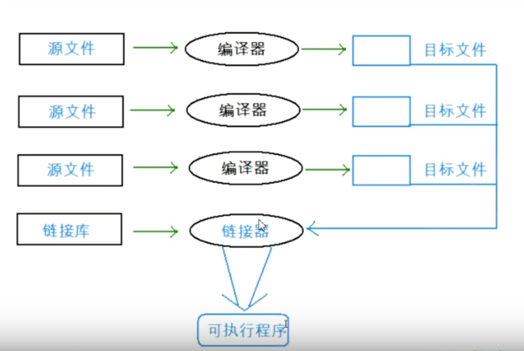

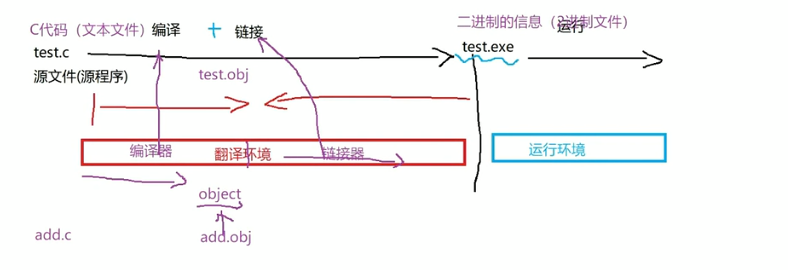

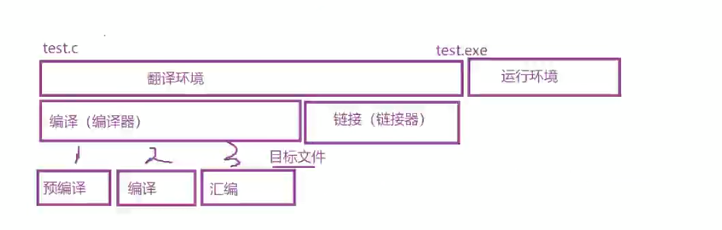

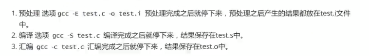
## 编译（编译器）
### 预处理阶段(文本操作)

`gcc -E <源文件>`表示显示预编译/预处理信息

`gcc -E test.c >> test.i` 将预编译信息重定向到`test.i`文件中。
1. 包含头文件（#include）
2. 注释删除
使用空格隔开 注释替换
3.#define 


- 预定义符号


### 编译阶段

`gcc ―S test.i`把c代码翻译成汇编代码（*.s），主要进行的操作有：语法分析，语义分析，符号分析

符号汇总：main、全局变量-->《编译原理》、《程序员的自我修养》。

### 汇编阶段

`gcc -c test.s`-->`test.o`得到了目标文件，把汇编代码转化为二进制指令，形成符号表：

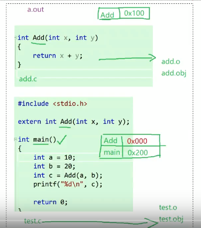

### 链接（链接器）
1. 合并段表（每个目标文件都会分段，段的格式一样，只是内容不一样）
2. 符号表的合并和重定位，(`linkerror`）

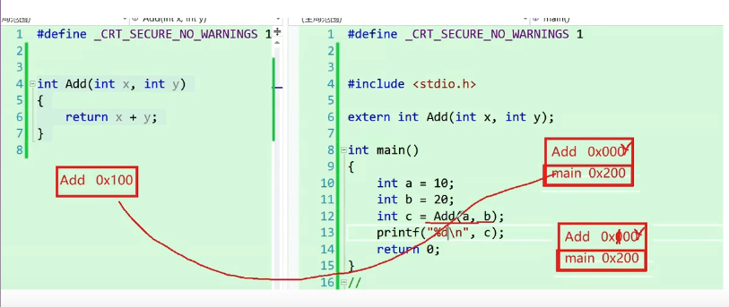

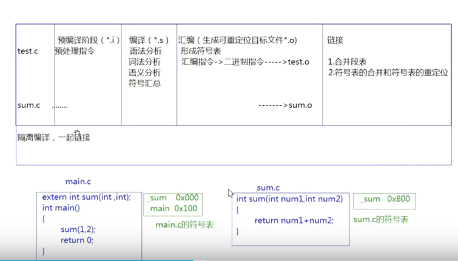

最终生成可执行文件

## 运行环境

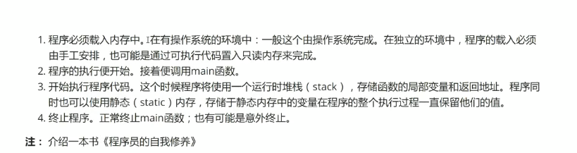

- 预定义符

| 预定义符 | 含义 |
|:----:|:----:|
|`__FILE__`|返回当前文件绝对路径|
|`__LINE__`|代码所在的行号|
|`__DATE__`|代码执行日期|
|<font color="red">`__TIME__`</font>|代码执行时间|
|`__STDC__`|如果编译器遵循ANSI C，其值为1，否则未定义（vs未定义，gcc为1）

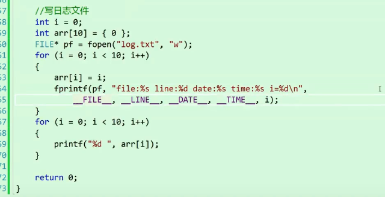

- 预处理指令

|预处理指令|含义|
|:----:|:----:|
|#define|1. 定义宏；2. 定义符号:`#define MAX 100`|


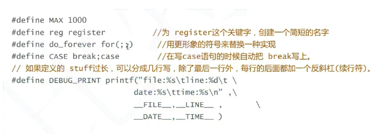
>在define定义标识符的时候，要不要在最后加上；？

比如：

```c
#define MAX 1000;
#define MAX 1000
```

下面这段代码就会出错：
```c
if (condition)
    max=MAX;//max=1000;;相当于两条语句，要加大括号{}
else
    max=0;
```
最好不要加；出错不便查找

**宏的定义**

1.
```c
#define SQUARE(X) X*X
int main()
{
    int ret = SQUARE(5);
    // int ret = 5*5;
    // 宏在调用位置展开，不是传参函数调用
    printf("ret = %d\n", ret); // 25
    int ret1 = SQUARE(5+1); // 11
    //int ret1 = 5 + 1 * 5 + 1;
    return 0;
}
```

改进
```c
#define SQUARE(X) (X)*(X)
```
2.
```c
#define DOUBLE(X) (X)+(X)
int main()
{
    int a = 5;
    int ret = 10 * DOUBLE(a);
    //10 * a + a
    printf("%d\n", ret);//55
    return 0;
}
```

改进
```c
#define DOUBLE(X) ((X)+(X))
```

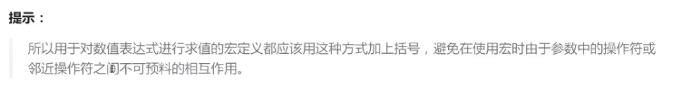

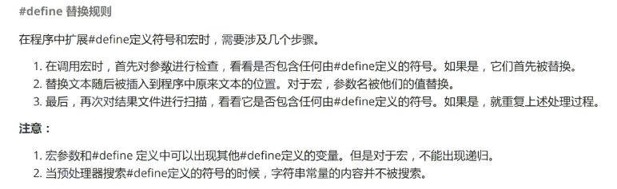


>#和##

1.
```c
void print(int a)
{
    printf("the value of a is %d\n", a);
}

int main()
{
    int a = 10;
    int b = 20;
    print(a);//the value of a is 10
    print(b);//the value of a is 20
    return 0;
}
```

改进：

```c
#define PRINT(X) printf("the value of"#X"is %d\n"); //#X-->"X"

int main()
{
    int a = 10;
    int b = 20;
    PRINT(a);//the value of a is 10
    PRINT(b);//the value of b is 20
    return 0;
}
```
2. 
```c
#define CAT(X, Y) X##Y
int main()
{
   int Class84 = 2019;
   //printf("%d\n", Class84);
   printf("%d\n", CAT(Class, 84));
   //printf("%d\n", Class##84);
   return 0;
}
```