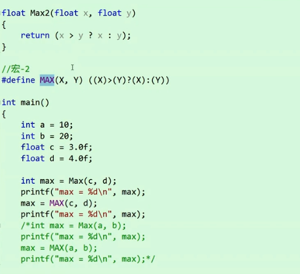
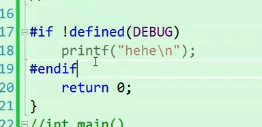

### 带有副作用的宏

```c
int main()
{
    int a = 10;
    int b = a + 1;
    int c = ++ a; // 对a的值造成影响
    return 0;
}
```


```c
#define MAX(X, Y) (X) > (Y) ? (X) : (Y)
int main()
{
    int a = 10;
    int b = 11;

    int max = MAX(a++, b++);//带有副作用
    //-> max = 12, a = 11, b = 13
    //int max = ((a++) > (b++) ? (a++) : (b++)) -> 不是先计算，而是直接拷贝，再计算
    printf("%d\n", max);
    return 0;
}
```

### 宏和函数的对比
宏的优势：

- 函数有类型的限制，宏没有

- 函数在调用的时候，会有函数的调用和返回的时间开销，宏在预编译阶段就完成语句的替换，比函数效率要高一些。


宏的劣势：
- 宏每次都是代码的替换，会增加代码的长度，函数每次都是调用同一份代码
- 不能处理错误，不方便调试，宏在预编译阶段处理，报出来的错误是替换之后的代码错误
- 没有类型的检查，导致容易预测
- 调用的地方与宏的内部有运算优先级的问题
- 存在有副作用的宏（只是拷贝代码），函数不存在这个问题

做一些函数没法做的事：
```c
#define SIZEOF(TYPE) sizeof(TYPE)
#define MALLOC(NUM, TYPE) (TYPE*)malloc(NUM*sizeof(TYPE))
```
inline 很好的解决了宏和函数之间的矛盾

## #undef

可以移除一个宏定义

### 命令行定义
在预编译阶段
`gcc -D ARRAY_SIZE=10 programe.c
`
### 条件编译
预处理指令
```c
#define DEBUG

int main()
{
	int arr[10] = { 1,2,3,4,5,6,7,8,9,0 };
	for (int i = 0; i < 10; ++i)
	{

		arr[i] = 0;
#ifdef DEBUG
		printf("%d ", arr[i]);
#endif
	}
	return 0;
}
```
1. #if 
```c
#if + 常量表达式
#endif
```
2. 多分支


3. 判断是否被定义





4. 嵌套指令


### 文件包含

**#include**
1. #include ""

首先包含本地文件，没找到去安装目录\<include\>下去找

2. #include <>

只会去库函数里面去找，找不到就会报错

**offsetof**宏的实现

```c
#define OFFSET(struct_name, member_name) (int)&(((struct_name*)0)->member_name)
```

假设结构体变量的起始地址为0


